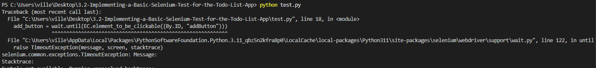
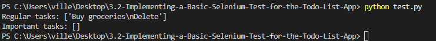
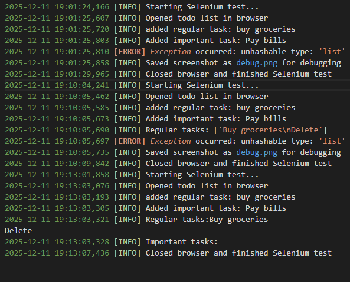

# 3.2: Implementing a Basic Selenium Test for the Todo List App

## Step 2-3
- This part was pretty smooth no issues downloading the todo list files, importing selenium libraries and downloading and placing the chrome driver.

## Step 4 
- while doing this we had some difficulties to get the button to work with find element it took us some time but the issue was the buttons didnt have button id's set so we had to manually set id's for the buttons.

- sending the sample task and clicking the add button didnt cause too much stress on us.

## Step 5
- this one took us a while but we managed to get something done with some help from ai. The ai provided us an example that gave us some direction where we should head with this one.

- after we got that done we expanded on the test to cover everything.

## Step 6
- debugging tools went pretty well and at the end we had all these tests done

# Reflection
- What we learned from this task was how to use selenium and python to locally test webapplications automatically. We also learned how to do inputs to said webapplications via selenium and python. We learned how to use the debugging tools in selenium. We are pretty sure we used the best practices of selenium.
For future improvements we could try to integrate it to CI/CD